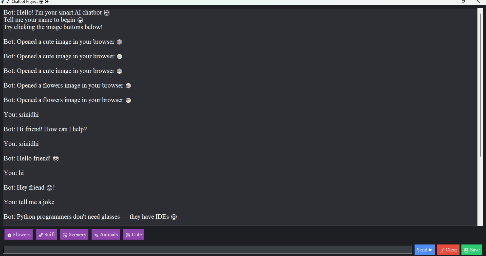

# AI_Project_chatbot
An AI-based advanced chatbot built using Python and Machine Learning. It uses Logistic Regression and TF-IDF to understand user messages and respond smartly. Includes a Tkinter GUI with image category buttons to display Animals, Flowers, Scenery, Sci-Fi, and Cute images. Simple, interactive and user-friendly design.
AI-Based Advanced Chatbot using Python & Machine Learning

This project is an interactive AI chatbot developed using Python, Tkinter GUI, and Machine Learning.
It understands user input using Logistic Regression + TF-IDF and responds intelligently with text.
The chatbot also displays image categories like Animals, Flowers, Scenery, Sci-Fi and Cute through browser automation.

# Features

 Machine Learning–based intent detection

 Real-time interactive responses

 GUI using Tkinter with dark theme

 Opens image links via buttons (5 categories)

 Timestamped messages for realistic chat feel

 Lightweight and fast performance

# Tech Stack

Python

Tkinter

Scikit-Learn

NumPy, Pandas

Pickle (model storage)

Webbrowser Module

📂 Project Structure
│ # GUI + chatbot logic
├── main.py 
# Trained ML classification model
├── model.pkl
# TF-IDF vectorizer
├── vectorizer.pkl
# Dataset of intents and responses
├── intents.json 
# Image URL categories for buttons
├── images.py 
# Folder containing screenshots (to upload)
└── assets/               
# OUTPUTS
  

 # How to Run

 # Install required modules:

pip install pandas numpy scikit-learn

 # Run the application:

python main.py

 # Learning Outcomes

Applied NLP feature extraction (TF-IDF)

Implemented ML model integration into GUI apps

Worked with browser automation for multimedia features

Improved debugging and project structuring skills

 # Future Enhancements

 Speech recognition
 More response categories
 Database storage for chat history
 Model improvement using neural networks

 # Developer

Mudumba Srinidhi
B.Tech – Artificial Intelligence & Machine Learning
